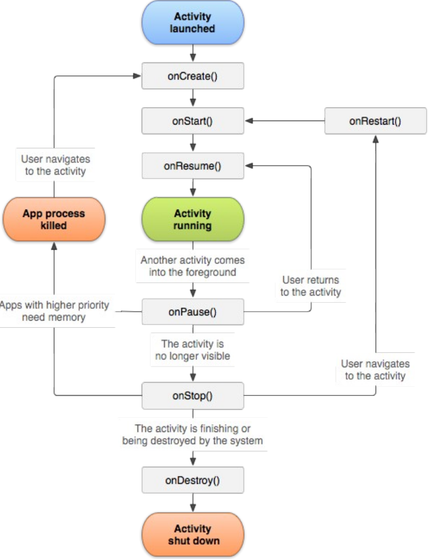
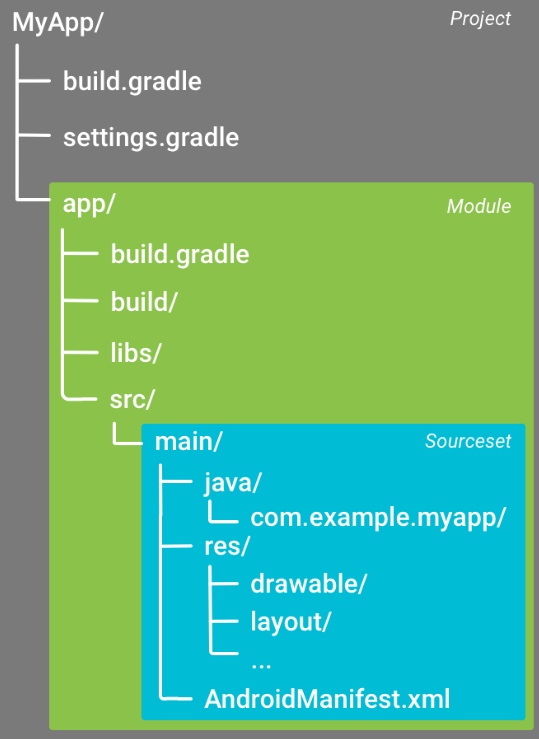
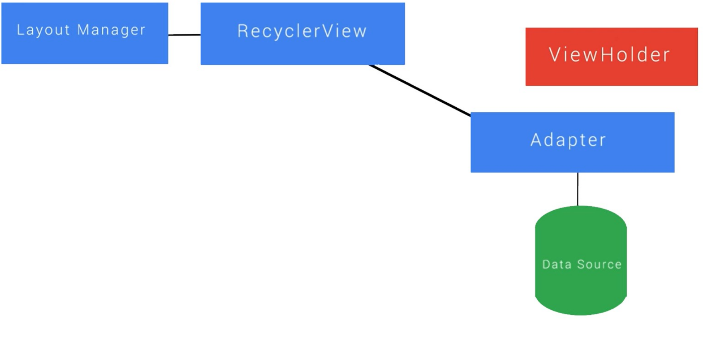

# Index table
- [Index table](#index-table)
- [Intro](#intro)
  - [Security](#security)
  - [Aplication structure](#aplication-structure)
    - [Android manifest](#android-manifest)
      - [Content](#content)
    - [Application code](#application-code)
      - [Android components](#android-components)
        - [Activities](#activities)
          - [Need a god title here](#need-a-god-title-here)
        - [Services](#services)
        - [Content provider](#content-provider)
        - [Broadcast receiver](#broadcast-receiver)
  - [Resources](#resources)
    - [Layouts](#layouts)
      - [UI Compontents](#ui-compontents)
      - [Layout or container views](#layout-or-container-views)
      - [XML attributes](#xml-attributes)
      - [Layouts in java](#layouts-in-java)
  - [Gradle](#gradle)
- [Input Events](#input-events)
  - [Event Listeneres](#event-listeneres)
  - [Event Handlers](#event-handlers)
  - [Input controls](#input-controls)
- [Intent](#intent)
  - [Use cases](#use-cases)
  - [Explicit intents](#explicit-intents)
  - [Implicit intents](#implicit-intents)
    - [Starting Activity](#starting-activity)
      - [Intent](#intent-1)
      - [Results](#results)
      - [Passing data](#passing-data)
    - [Intent Filters](#intent-filters)
- [User interface](#user-interface)
  - [Views](#views)
    - [View attributes](#view-attributes)
  - [View Groups](#view-groups)
  - [Layouts](#layouts-1)
    - [FrameLayout](#framelayout)
      - [Frame](#frame)
      - [Linear](#linear)
      - [Grid](#grid)
      - [Relative](#relative)
      - [Constraint](#constraint)
  - [Constraints](#constraints)
  - [Responsive Design](#responsive-design)
  - [Localization](#localization)
- [RecyclerView](#recyclerview)
  - [How it works](#how-it-works)
  - [Optimizations](#optimizations)
  - [Layoutmanager](#layoutmanager)
  - [Viewholder](#viewholder)
  - [Recyclerview Items](#recyclerview-items)
  - [Adapter](#adapter)
  - [Listener interface](#listener-interface)
- [Networking & Threading](#networking--threading)
  - [URI](#uri)
- [Storing Data: Database](#storing-data-database)
  - [Storing steps](#storing-steps)
  - [Database contract](#database-contract)
  - [Database creation](#database-creation)
- [Prefrences](#prefrences)
  - [OnSavedInstanceState](#onsavedinstancestate)
  - [SharedPrefrences](#sharedprefrences)
      - [PreferenceFragment](#preferencefragment)
  - [Database](#database)
  - [File Storage](#file-storage)
  - [Online storage](#online-storage)

# Intro

## Security

- Multi-user Linux system
- Each app
    - Different user
    - Unique uid with permssiosn for own app
    - Own VM
    - Own Linux Process
    - Only access to components it requires (principle of least privilege)

## Aplication structure

### Android manifest
Is en XML based file names 'AndroidManifest.xml'.  
This is used by Google Play to check app compatibility

#### Content
- Package (app) name
- App Components (declerations)
    - Activities
    - Services
    - Broadcast Receivers
    - Content Providers
- Permissions
    - uses-permissions  
        Device features rquired, like Internet or SMS
- Hardware and software features needed
    - uses-feature  
        Hardware features required
    - uses-sdk  
        This will be overwritten by Grade
        - minSDK: Minimum API version
        - targetSDK: Minimum API version  
            Latest version by default


- Code for components
- Resources
- Grade build system

<details>
<summary> Example </summary>

```xml
<?xml version="1.0" encoding="utf-8"?>
<manifest xmlns:android="http://schemas.android.com/apk/res/android"
    package="com.example.appdev">

    <uses-feature android:name="android.hardware.camera.any"
                  android:required="true" />
    <uses-sdk android:minSdkVersion=“21"
              android:targetSdkVersion=“31" />
    <uses-permission android:name="android.permission.READ_EXTERNAL_STORAGE" />
    <uses-permission android:name="android.permission.INTERNET" />

    <application
        android:allowBackup="true"
        android:icon="@mipmap/ic_launcher"
        android:label="@string/app_name"
        android:roundIcon="@mipmap/ic_launcher_round"
        android:supportsRtl="true"
        android:networkSecurityConfig="@xml/network_security_config"
        android:theme="@style/Theme.AppDev">
        <activity
            android:name=".SettingsActivity"
            android:exported="false" />
        <activity
            android:name=".EaterActivity"
            android:exported="false" />
        <activity
            android:name=".Factory"
            android:exported="false" />
        <activity
            android:name=".MainActivity"
            android:exported="true">
            <intent-filter>
                <action android:name="android.intent.action.MAIN" />

                <category android:name="android.intent.category.LAUNCHER" />
            </intent-filter>
        </activity>
    </application>
</manifest>
```

</details>

### Application code

#### Android components
##### Activities
- Entry point for interaction with the user
- Single screen with a user interface
- Work together for cohesive user experience
- Independent of eacht other

###### Need a god title here
- Fundamental building block
- Almost all interact with the users
- Activity class creates window
- Lifecycle translates into a lot of methods in the activity



```java
public class MainActivity extends AppCompatActivity {
    @Override
    protected void onCreate(Bundle savedInstanceState) {
        super.onCreate(savedInstanceState);
        setContentView(R.layout.activity_main);
    }
}
```
- onCreate()
    - Must be implemented
    - Basic application startup logic
    - Can restore previously saved state
- onStart()  
    Makes activity visible to user
- onResume()  
    Intializes components that must occur every time the activity is restarted  
    after being paused
- onPause()  
    Called first after user start leaving activity
    - used to release resourcces no longer necessary
    - Can stay in paused state until activity resume
- onStop()  
    Occurs when activity no longer visible to user
    - Used to release resources not needed when activity not visible
    - Perform CPU-intentsive shutdown operations
- onDestroy()  
    Called when activity destroyed
    - Used to release resources not released yet

##### Services
- Entry point for keepign app running in background
    - Long running operaitons
    - Work for remote processes
- No user interface  

##### Content provider
- Manges a shared set of data that can be stored
    - File system
    - SQLite database
    - online
    - ...
- Lets other apps query or modify data

##### Broadcast receiver
- Enables the sytem to deliver events to an app outside the reuglar user flow
- Allow app to respond to system-wide broadcast announcements
- Many are system events
    - Screen turned off
    - Battery low
    - Picture captured

## Resources
- Provided through xml files
- Visual presentation of the app
    - Images
    - Styles
    - Animations
    - ...
- Simple constants
    - Colors
    - Strings
    - Booleans
- Variety of devices
    - Screen size/density/orientation
- Handler through quoalifiers inthe dir names

### Layouts
Defined in XML

<details>
<summary> Example </summary>

```xml
<?xml version="1.0" encoding="utf-8"?>
<LinearLayout xmlns:android="http://schemas.android.com/apk/res/android"
    xmlns:tools="http://schemas.android.com/tools"
    android:layout_width="match_parent"
    android:layout_height="match_parent"
    android:orientation="vertical"
    android:padding="16dp"
    tools:context="com.example.android.exampleapp.MainActivity">

    <EditText
        android:id="@+id/edit_text_name_input"
        android:layout_width="match_parent"
        android:layout_height="wrap_content"
        android:background="@color/colorAccent"
        android:hint="Enter your name"
        android:padding="4dp"
        android:textSize="24sp" />

    <TextView
        android:id="@+id/text_view_name_display"
        android:layout_width="wrap_content"
        android:layout_height="wrap_content"
        android:layout_gravity="center"
        android:layout_marginTop="8dp"
        android:text="Your name appears here"
        android:textSize="30sp" />
</LinearLayout>
```

</details>

#### UI Compontents
| Class Name  | Description                                                 |
|-------------|-------------------------------------------------------------|
| TextView    | Creates text on the screen; generally non interactive text. |
| EditText    | Creates a text input on the screen                          |
| ImageView   | Creates an image on the screen                              |
| Button      | Creates a button on the screen                              |
| Chronometer | Creates a simple timer on screen                            |

#### Layout or container views
| Class Name       | Description                                                                                                               |
|------------------|---------------------------------------------------------------------------------------------------------------------------|
| LinearLayout     | Displays views in a single column or row.                                                                                 |
| RelativeLayout   | Displays views positioned relative to each other and htis view.                                                          |
| FrameLayout      | A ViewGroup meant to contains a single child view.                                                                        |
| ScrollView       | A FrameLayout that is designed to let the user scroll through the content in the view.                                    |
| ConstraintLayout | This is a newer viewgroup; it postions views in a flexible way. We'll be exploring constraintslayout later in the lesson. |
| GridLayout       | A layout that places its children in a rectangular grid.                                                                  |

#### XML attributes
- Control the properties of a view
- Determine how a biew looks and interacts
- Examples: Text, Widh and height, Padding and Margin, Color

#### Layouts in java
Loading in the onCreate() method of the activity through setContentView()

<details>
<summary> Example </summary>

```java
public class MainActivity extends AppCompatActivity {
    @Override
    protected void onCreate(Bundle savedInstanceState) {
        super.onCreate(savedInstanceState);
        setContentView(R.layout.activity_main);
        // other code to setup the activity
    }
    // other code
}
```
</details>

## Gradle
- Open source build automation system  
    Not only for android
- Scription tool to build software in general  
    Compile code, Link to libraries, Run tests, Create packages, ...
- 3 steps
    1. Initialization  
        Set up environment for build
    2. Configuration  
        - Construct task graph
        - Determine tasks to run and in which order
    3. Execution  
        Run the selected tasks
- Build Type  
    Debug, Release
- Manifest Entries
    Overrides value of the manifest: App Name, min API version, target API version



# Input Events
- Interaction between the user and the application
- Extendable input

## Event Listeneres
- Interface in View vlass with one callback method
- Called when a niew is triggered by user Interaction
- Dependent on input controls
- Examples
    - OnClickListener -> OnClick()
    - OnLongClickListener -> OnLongClick()
    - OnTouchListener -> OnTouch()

## Event Handlers
- Used for extension of a View
- Define default even behavior
- Examples:
    - onKeyDown
    - onTouchEvent
    - dispatchTouchEvent

## Input controls
- Interactive components in the UI
- Described in layout trhough XML element
- Supports set of specific input events
- Examples:
    - Button
    - CheckBox
    - Spinner
    - EditText

# Intent
- Don't call eachother directly
    - Use messaging objects called intents
- Let an app request tahn an action takes place
    - start new activity
    - Display Photo from gallery
    - Make phone call
- Contains also:
    - Which component to deliver to
    - Small amount of data
        - Packaged as extras
        - Primitive tuples

## Use cases
- Starting an activity
- Starting a service (API lvl <= 20)
- Delivering a broadcast

## Explicit intents
- Specify which component will satisfy intent
    - App's package name
    - Class name
- Typically used to start component in own app

## Implicit intents
- Don't specify component
- No receiver specified
- Declare general action to perform
    - Other apps can respond to this
    - System looks through intent filters of all apps to:
        - Start activityy that can respond to the action
        - Let user choose an appt ot respond to the action
    - Data can be packaged


### Starting Activity
#### Intent
- Describes activity to start
- Carries necessary data
- startActivity(Intent)

#### Results
- Calling activity receives separate intent object
- Can handle object in specific callback function
- startActivityForResult(Intent)

#### Passing data
- Data elements can be put into the intent envelope
- Data elements are called extras (Primitives stored as key-value pairs)
    - `putExtra()`: Give to intent
    - `get<Type>Extra()`: get out of intent

### Intent Filters
- More than one intent filter can be declared for an activity
    - Activity should respond differently to each filter
- Intent filter can contain 3 elements  
    1. \<action>
        - Intent action accepted, in name attribute
        - Must be a literal string value of an action
    2. \<data>
        - Type of data accepted
    3. \<category>
        - Intent category accpeted, in name attribute
        - CATEGORY_DEFAULT must be included
    - A filter  can contain more than one instace of these elements
        - Component needs to be able to handle all combinations

# User interface
## Views
- To build a UI Views are used???
    - Has a lot of attrubutes that can be set
- View
    - A rectangle that appears on the screen
    - Handles drawing and event handling
- All basic widgets extend from a view

### View attributes
- Widht & height
    - how child is laid out is dependent on its parent
    - View widht & height show this well through their special attribte values
        - wrap_content
        - match_parent
- Gravity
    - 2 types
        1. gravity attributes of text fields sets the position of the text inside a View
        2. layout_gravity of a View positions the view relative to the parent layout
- Padding and margin
    - padding hsift content inside the View itself
    - layout_margin adds a margin around the View and
    - Both can be set
        - Per edge: Top, Left, Bottom, Right
        - For all edges at once
- Visibility
    - Every view has a visibility attribute
    - 3 options
        1. Visible
        2. Invisible
        3. Gone
    - The attribute can be set durign runtime
        - `setVisibility(View.INVISIBLE);`

## View Groups
- Multiple view together go in ViewGroups
    - Base class for Android layouts
    - Extends from View

## Layouts
- ViewGroups extends from view (why is this under layouts?)
- ViewGroups can be nested
- Lots of possibilities to create layouts (I hope so)
- Nesting Results in decreased performance

### FrameLayout
| Class Name       | Description                                                                                                               |
|------------------|---------------------------------------------------------------------------------------------------------------------------|
| LinearLayout     | Displays views in a single column or row.                                                                                 |
| RelativeLayout   | Displays views positioned relative to each other and htis view.                                                          |
| FrameLayout      | A ViewGroup meant to contains a single child view.                                                                        |
| ScrollView       | A FrameLayout that is designed to let the user scroll through the content in the view.                                    |
| ConstraintLayout | This is a newer viewgroup; it postions views in a flexible way. We'll be exploring constraintslayout later in the lesson. |
| GridLayout       | A layout that places its children in a rectangular grid.                                                                  |

#### Frame
- Display one View that is placed in the top left corner
- Other View added will stack on top of eacht other

#### Linear
- Child Views are oredered horizontally or vertically
- Each child can be given a weight to give it more or less space than the other Views

#### Grid
- Layout divided in cells for each View
- View can span multiple cells

#### Relative
- Specify for each View if they should be aligned to parents edges
- Specify for each View howthey should be aligned relative to each other

#### Constraint
- Allow to place Views relative to parent and toher Views
- Uses contraints to specify how each View should be positioned and scaled accordingly  
    relative to other views
-  Allow for complicated layouts without having to nest different layouts
- Views added in designer wil be set to left 
- To position a view, atl east 2 constreaints need to be added for that view
    1. 1 horizontal
    2. 1 vertical
- Allow for every complex layouts without nesting ViewGroups
- Views can be easily moved together

## Constraints
- Are defined the 'app' namespace
    - Attributes start with app: instead of android: 
    - Automatically added with ConstraintLayout
- Defined as edge connection to edge of other view
- Keeps Views aligned to each other
    - Layout_constraintLeft_toLeftOf
    - Layout_constraintTop_toTopOf
    - ..
- Keeping views next to each other
    - Layout_contraintLeft_toRightOf
    - Layout_constraintTop_toBottomOf
    - ...

## Responsive Design
- Different layouts can be used for different screens
- An app can look differently depending on the
    - Screen size
    - Orientation
- Parts that look the same in different layouts can be move to their own layout files
    - then inculded in hte main layout files
    - Make sure to not have an include loop

## Localization
- Translation of text trhough the strings.xml file
- New values folder in the res directory for other languages/countries
    - values-xx-xx with
        - first xx abbreviation of language
        - second xx abbreviation of region
- Copy needed strings from strings.xml and reanslate to the other language
- Strings for keys or names don't need to be translated

# RecyclerView
- Mechanism to be able tos croll through thousands of itmes without getting memory constraint
- More advanced and flexible version of ListView
- Flexible view for providing a limited window into a large dataset
- Several different components work toghether to display the data
    - RecyclerView object
    - Layout manager
    - ViewHolder objects
    - Adpater


## How it works
1. RecylerView has an adapter that provides views when needed
2. Adpater vinds data from a dat source to the RecyclerView
3. Adapter sends view through an object called a ViewHolder to the RecyclerView
4. LayoutManager tells RecyclerView how to layout the views



1. The RecyclerView first asks the adapter how many items it wil have to display
2. RecyclerView asks adapter to create ViewHolder objects and inflate views from  
    XML, by calling `onCreateViewHolder()`
3. Adapters `onCreateViewHolder()` is responsible for creating views and returning ViewHolders
    objects associated with these views
3. After ViewHolders are created, RecyclerView
    will call adapters `onBindViewHolder()` to populate
    each item with data
4. When scrolling, RecyclerView reuses ViewHolders asking the adapter to bind
    new data to them

## Optimizations
- When first populated
    - Creates and vinds data to view holders in view
    - Creates and vind extra view holders on either side of on-screen list
- When scrolling
    - Creates new view holders ans necessary
    - Saves off-screen view holders for reuse
    - Wheb scrolling back: brings back view holders
    - When scrolling further: Rebinds new data to view hodlers that have  
        been off-screen longest
- Wheb displayed items change
    - Notify adpater by canceling a notify method
    - Adatoper rebinds only the affected items

## Layoutmanager
The layout manager is a key part in the way recyling viewholders works
- Determines when to recyle item view that are nog longer visible
- Three stendard implementations
    1. LinearLayoutManger  
        Scrolls vertically (default) or horizontally
    2. GridLayoutManager  
        Arranges items in a grid
    3. StaggeredLayoutManager  
        offset gird of items

## Viewholder
Constainds refernece to biew object of the item
- Are cached
    - Only load them once (findViewById) wheb created
- Example: 30 items, 4 views each
    - 8 onscreen + 2 extra
    - No caching
    - ? How many extra calls to findVieById ?

## Recyclerview Items
An items is what will be displayed and wil be cached by a ViewHolder object
- Consists of one or more views
- Defined in a separate layout xml file

## Adapter
Separate class that extand from `RecyclerView.Adpater<ViewHolder>`
- Has a public constructor to create the adapter and initialize members
- Create new items in th form of ViewHolders
    - `onCreateViewHolder()`
        - Inflates items
        - Instantiates new ViewHolders by calling constructor of inner class
- Populates items with data
    - `onBindViewHolder()`
        - Called when view needs to be populated with data
- Returns information about the data (how many items)
    - `getItemCount()`
        - Returns number of items in data source

## Listener interface
An interface to define the listener (never would have gussed that)
- Implements one function
    - Takes the clicked item index
- Adapter class needs to store a reference to the listener in member variable
    - Constructor takes extra paramter: the listener
    - Listener paramter is tored in member variable

# Networking & Threading
## URI
Unifrom Resource Identifier

- String of characters taht identifies a resource
    - URL for we and network
    - GEO for physical location
    - ...
- Has a lot of parts, most of which are optional
- For the resource types http, https, ftp, geo, ...
    - [OPTIONAL] Authority
        - [OPTIONAL] Username:Pasword
        - [OPTIONAL] Port
- Path: points to resource
    - scheme:[//[user:password@]host["port]]path[?query[&extraquery]][#fragment]

TODO: this entire chapter

# Storing Data: Database
- SQLite
    - 2 operation modes
        1. Read Only
        2. Read/Write
    - CRUD operations
        - **C**reate -> Insert (W)
        - **R**ead   -> Query  (R)
        - **U**pdate -> Update (W)
        - **D**elete -> Delete (W)
    - Interal Storage
        - Private to your app

## Storing steps
1. Define schame and contract
2. Craete database
3. Put info in database
4. Read info from database
5. Delete info from database
6. Update database

## Database contract
- Feed reader
```java
public final class FeedReaderContract {
    private FeedReaderContract() {}
    public static class FeedEntry implements BaseColumns {
        public static final String TABLE_NAME = "entry";
        public static final String COLUMN_NAME_TITLE = "title";
        public static final String COLUMN_NAME_SUBTITLE
            = "subtitle";
    }
}
```

## Database creation
- Create helper class
    - Extension class from SQLiteOpenHelper
        - Create database for first time with info from Contract class
    - Gives a means to update database schema
    - Provides a reference to database for other classes
        - Potentially long running operations will only be performed when needed
    - SQLiteOpenHelper
        - 2 important constants
            1. DATABASE_NAME: name of the file for the database
            2. DATABSE_VERSION: verson number of the database
        - 2 important methods
            1. `oncreate`: creating database for the first time
            2. `onUpgrade`: keeping database schema up to date

    - To access the database this class needs to be instantiated

TODO: Cursors

# Prefrences
The act of saving data to the phone
5 ways on android
1. onSavedInstanceState
2. SharedPreferences
3. SQLite Database
4. Internal/Extertnal storage
5. Server

| Persistence Option | Type of data saved | Length of time saved |
|-|-|-|
| onSaveInstanceState | key/value (complex values) | While app is open |
| SharedPreferences | key/value (primitive values) | Between app and phone restarts |
| SQLite Database | Organized, more complicated text/numeric/boolean data | Between app and phone restarts |
| Internal/External storage | Multimedia or larger data | Between app and phone restarts |
| Server (Ex. Firebase) | Data that multple phones will access | Between app and phone restarts, deleting the app, using a different phone, ... |

## OnSavedInstanceState
- Used to store data to restore the state of view
    - After screen rotations
    - In change of screen widht
    - When activity is destroyerd by system (memory constraints)
- When activity recreated, original state recreated
- Data only stored during active app use
- Data stored in object called Bundle
- Key-value pairs

## SharedPrefrences
- A file to store simple key-value pairs
    - Key is a string
    - Value is a primitive type
- Used to store simple information about a user
    - Player's name in a game
    - Last visited website
- used to store settings in an app
    - Through a PreferenceFragment
- Stored in filesystem
    - Accessible as long as phone works and app hasn't been uninstalled

#### PreferenceFragment
- Subclass of fragment class
- Specifically for settings
- Provides standard layout
- Preferences defined using XML
    - Generates UI widgets in the fragment
    - Comparable to inflating layout XML files
- Updates in PreferenceFragment updates the SharedPreferences file

TODO: Setup prefrences


## Database
- SQLite internal database provided
- Stores more complicated information
- Accessible directly or with ContentProvider

## File Storage
- 2 types
    - Internal storage: HDD in phone (Euhm HDD?!)
    - External storage: SD-card
- To store large amounts of data
    - Multimedia: Video, Audio, Pictures
    - Large amounts of text

## Online storage
- Data stored online
    - Own server
    - Cloud service like Firbase
- Accessible by different devices


